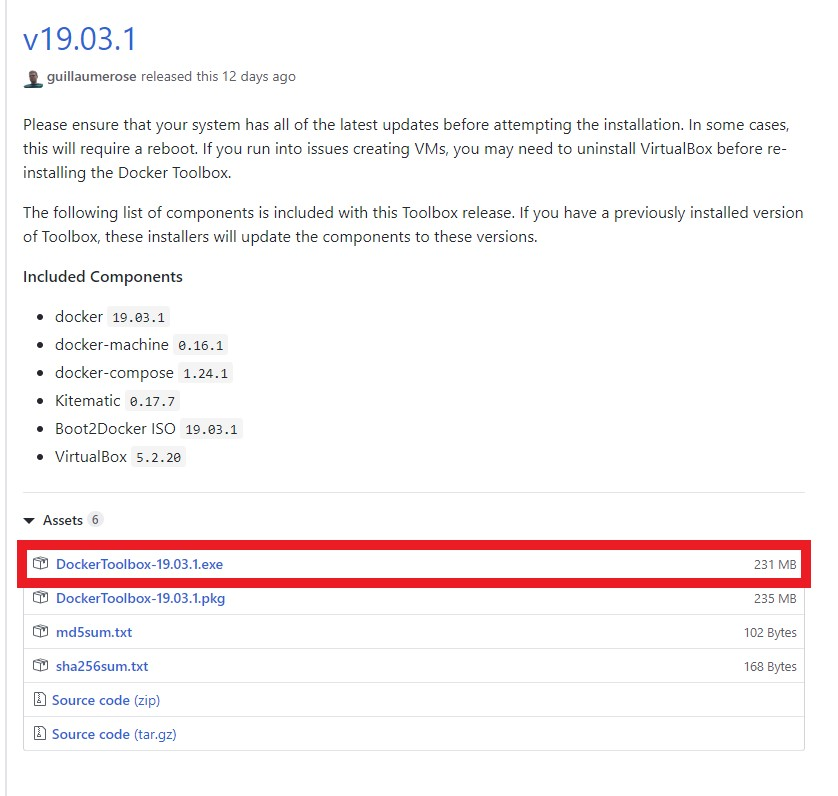
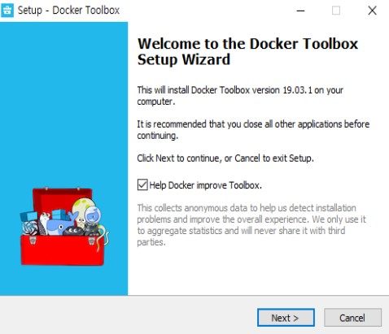
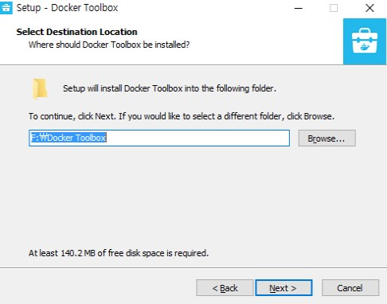
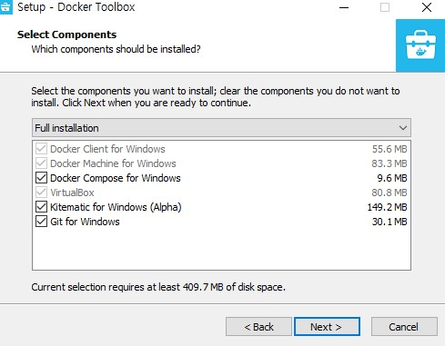
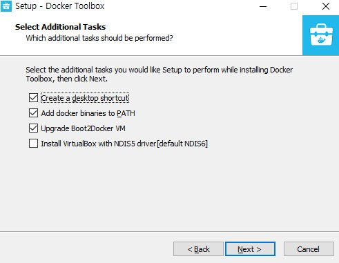
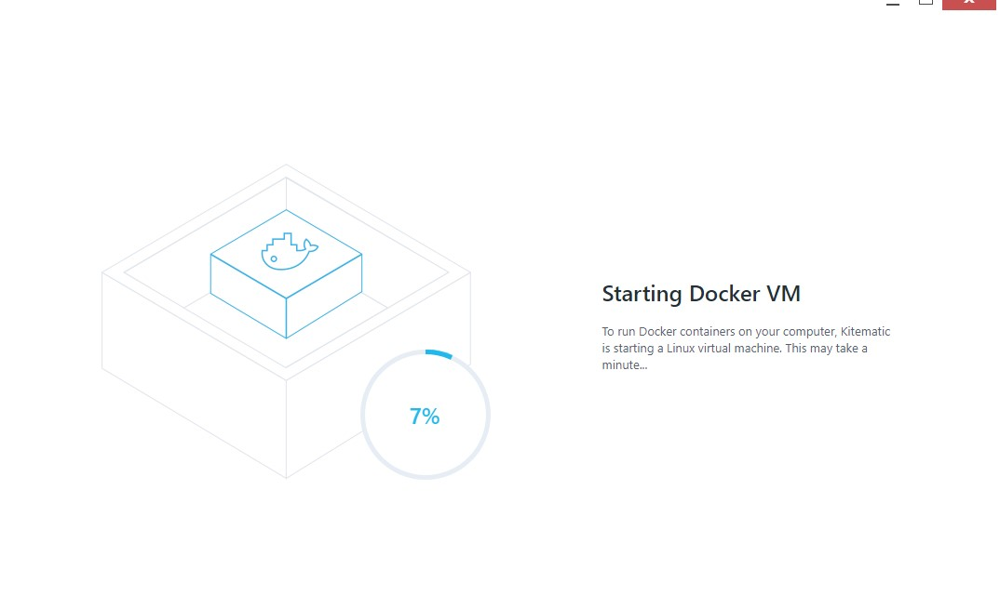
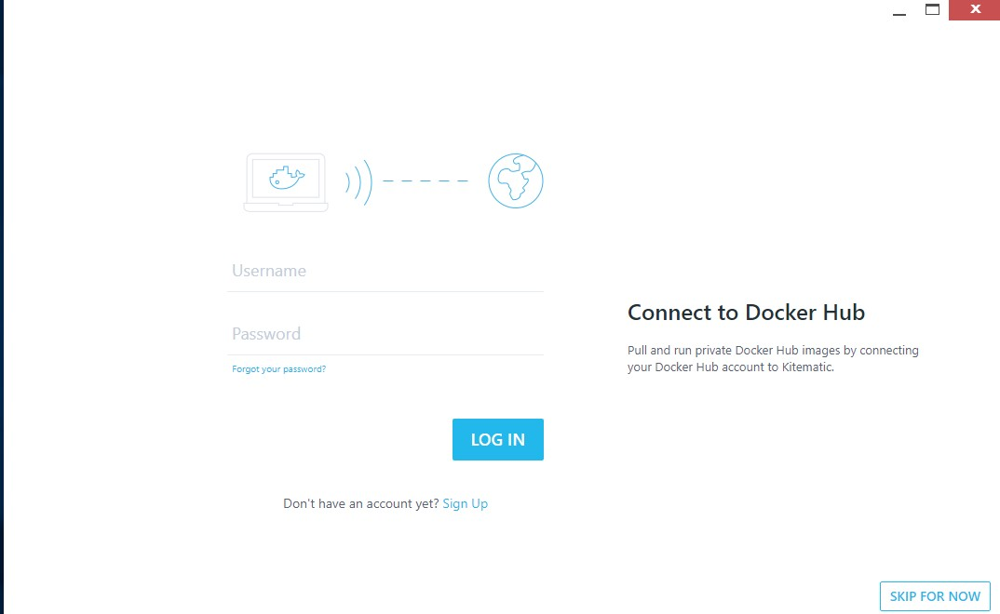

# 윈도우10 Docker Toolbox 설치.

친구들과 토이 프로젝트를 진행하면서 전체적인 환경구성이 필요했습니다..

간단한 메신저 프로그램을 개발하기로 결정되었고, 로컬 개발 환경은 도커를 사용하기로 결정했습니다.

우선 집에 PC가 윈도우 10 Home 버전이다 보니 Docker Desktop을 설치할 수 없어 ToolBox를 설치하게 되었습니다.

## 1. Docker Toolbox 다운로드

아래 경로에 접속하시면 Docker Toolbox를 다운로드 가능합니다.

<https://github.com/docker/toolbox/releases>



설치하기 간편하게 exe 파일로 다운을 받겠습니다.

## 2. Docker Toolbox 설치



next 클릭



설치 디렉토리를 설정



저는 전체 설치로 설정하겠습니다.



바로 next 

한번더 next 후 install 진행~



설치 완료 후 실행 화면입니다. 여기서 캡쳐하지 않았지만, 같이 설치된 VirtualBox를 사용하여 Docker를 실행시켜야 합니다.



정상적으로 설치가 완료된 경우 위 화면이 나타납니다.

여기서 신규가입 하거나 기존에 가입된 계정으로 접속하여 도커 사용이 가능합니다.

## 3. Docker 데몬 실행 중 에러 발생 케이스

### 3.1 ENOENT: no surch file or directory, open '디렉토리\ca.pem' 에러 

도커데몬 설정 중 기본으로 생성한 VirtualBox default VM 재설치 대신 아래 명령어를 사용하여 처리 가능합니다.

```text
docker-machine -D regenerate-certs default
```
참고 링크 : <https://github.com/docker/kitematic/issues/1008> 

### 3.2 virtualbox E_FAIL (0x80004005) 에러

* 첫번째. 버츄얼박스 Extension Pack 설치
    
    * link : <https://www.virtualbox.org/wiki/Downloads>

* 두번째. DRM 프로그램으로 인한 실패

    * 악명높은 fasoo drm 으로 인하여 실행 실패
    * 저는 두번째 케이스로 실행이 안됐습니다

다음 포스트는 Docker를 사용하여 ubuntu 와 nginx를 구성해보겠습니다.

-----


