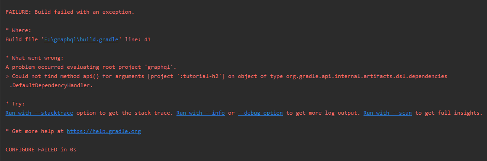

평상시 사내에서 Gradle 대신 익숙한 maven을 주로 사용하던 중 우아한형제들의 기술블로그에 권용근님이 작성하신 '[멀티모듈 설계 이야기 with Spring, Gradle](http://woowabros.github.io/study/2019/07/01/multi-module.html)'를 보고 토이프로젝트에 적용해보기로 했습니다.

여러 뻘짓을 해가며 멀티모듈 구성을 진행하는 중 Could not find method api() 에러가 발생하여 확인이 필요했습니다. 



구글링을 해보니 plugin에 추가설정이 필요한걸 확인하게 되었습니다.

<https://stackoverflow.com/questions/49423330/could-not-find-method-api-for-arguments-directory-libs>

```gradle
plugins {
    'java-library'
}

or

apply plugin: 'java-library'

```

해당 설정 후 다시 gradle 빌드를 진행하니 성공!!


추신. 구글링에서 검색한 stack orverflow에 내용을 보면 공식문서에도 자세히 나와있었네요..

항상 느끼지만 어떤 기술을 배울때 공식문서만한게 없는거 같습니다.

<https://docs.gradle.org/current/userguide/java_library_plugin.html>


-----


